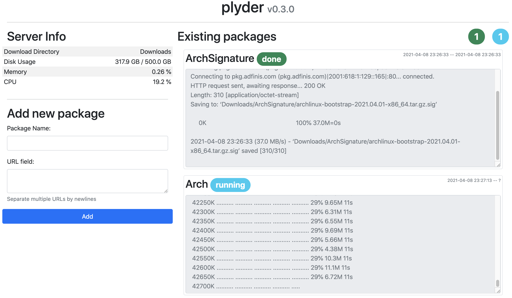

# plyder

[](https://pypi.python.org/pypi/plyder)
[](https://github.com/kpj/plyder/actions)

Download manager with web-interface.




## Installation

```python
$ pip install plyder
```


## Usage

```bash
$ plyder
```

`plyder` works out of the box. Though you might want to adapt the configuration to your taste.
